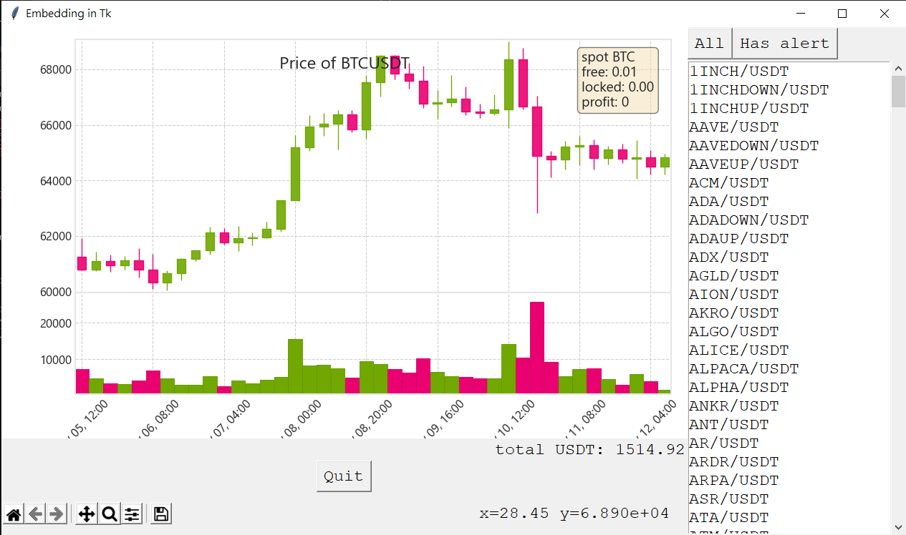

# Trading Alert

Free trading alert tool

# Supported exchange
* Binance
# Features
* Drawings
* Auto Refreshing Price on set alert
* Open/Close Volume panel

# Keyboard Shortcuts
* **"t"** to draw trend line
* **"-"** to draw horizontal line
* **"1"** to draw vertical line
* **"a"** to set alert
* **"z"** to delete alert
* **"d"** to delete all
* **"u"** to update price
* **"="** to open/close volume panel

# Requirements
* python-binance
* Matplotlib
* Mplfinance
* Tkinter

# To do list
- [x] E-mail notification
- [x] Windows notification